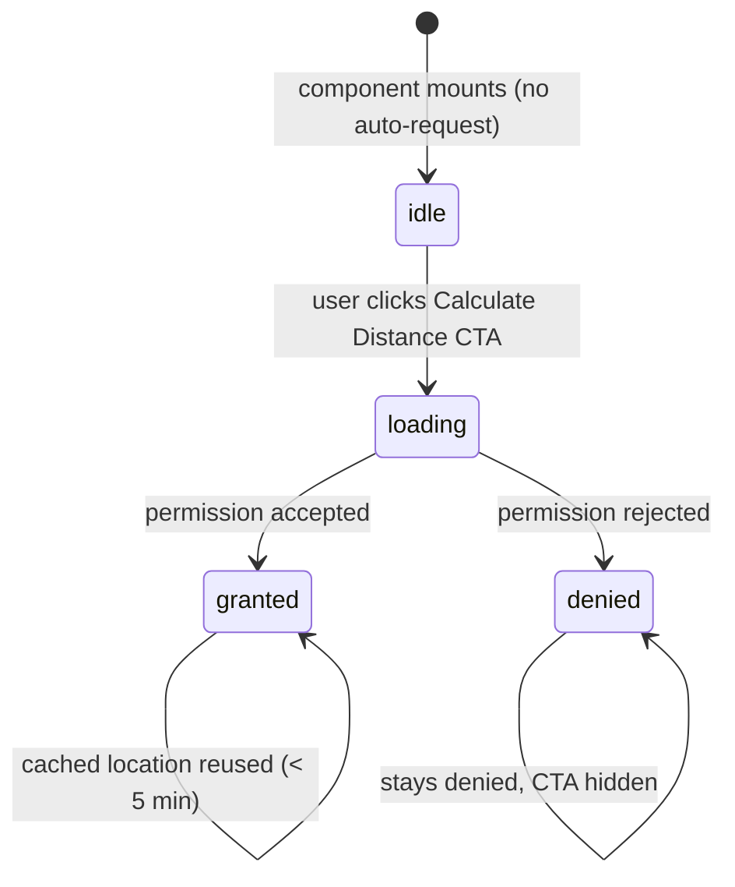

# Design Document: Calculate Distance CTA

## Overview

This feature replaces the automatic browser geolocation request (triggered on page load) with an explicit user-initiated "Calculate Distance" CTA button on all gear cards. The change improves user experience by eliminating unsolicited permission prompts and giving users control over when they share their location.

The implementation is surgical: the `useGeolocation` hook is modified to be passive by default (no auto-request), a `requestLocation` callback is exposed, and `DistanceDisplay` is updated to render the CTA button in the idle state. All other distance calculation logic remains unchanged.

## Architecture

The change flows through three layers:

```
DistanceDisplay (UI)
  └── useDynamicDistance (distance computation)
        └── useGeolocation (browser API + cache)
```

Currently `useGeolocation` auto-calls `getCurrentPosition` on mount. After this change:

- `useGeolocation` initializes in an `idle` permission state and only calls `getCurrentPosition` when `requestLocation()` is explicitly invoked.
- `useDynamicDistance` passes `requestLocation` through to the caller.
- `DistanceDisplay` renders the CTA button in the `idle` state, wiring the button's `onClick` to `requestLocation`.



No new components are introduced. `EquipmentCard` and `CompactEquipmentCard` already render `DistanceDisplay` — they require no changes.

## Components and Interfaces

### `useGeolocation` (modified)

```ts
interface GeolocationState {
  latitude: number | null;
  longitude: number | null;
  error: string | null;
  loading: boolean;
  permissionDenied: boolean;
  permissionState: 'idle' | 'loading' | 'granted' | 'denied';
}

interface UseGeolocationResult extends GeolocationState {
  requestLocation: () => void;
}
```

Key behavioral changes:
- Remove the `useEffect` that auto-calls `getCurrentLocation` when no cache exists.
- On mount, check `localStorage` for a fresh cached location (< 5 min old). If found, hydrate state directly — no permission prompt.
- Expose `requestLocation` (renamed from `getCurrentLocation` for clarity) as the sole trigger for `getCurrentPosition`.
- Initial `permissionState` is `'idle'` when no cache exists.

### `useDynamicDistance` (modified)

```ts
interface DynamicDistanceResult {
  distance: number | null;
  loading: boolean;
  error: string | null;
  isLocationBased: boolean;
  permissionDenied: boolean;
  permissionState: 'idle' | 'loading' | 'granted' | 'denied';
  requestLocation: () => void;
}
```

Passes `requestLocation` and `permissionState` through from `useGeolocation`.

### `DistanceDisplay` (modified)

Renders one of four states based on `permissionState`:

| State | Rendered output |
|---|---|
| `idle` | `<Button variant="outline">Calculate Distance</Button>` |
| `loading` | `"Calculating distance..."` |
| `granted` | `"{value}mi away"` or `"< 0.1mi away"` |
| `denied` | `"Distance not available"` |
| geolocation unsupported | `"Distance not available"` |

The CTA button's `onClick` calls `requestLocation()`.

### `EquipmentCard` / `CompactEquipmentCard`

No changes required. Both already render `<DistanceDisplay equipment={equipment} />`.

## Data Models

### localStorage cache (`userLocation`)

```ts
interface CachedLocation {
  latitude: number;
  longitude: number;
  timestamp: number; // Date.now() ms
}
```

Cache key: `userLocation`
Staleness threshold: 300,000 ms (5 minutes)

Cache is read on mount. If fresh, state is hydrated to `granted` with the cached coordinates. If stale or absent, state starts as `idle`.

## Correctness Properties

*A property is a characteristic or behavior that should hold true across all valid executions of a system — essentially, a formal statement about what the system should do. Properties serve as the bridge between human-readable specifications and machine-verifiable correctness guarantees.*

### Property 1: No auto-request on mount without cache

*For any* mount of `useGeolocation` with an empty or stale `localStorage`, `navigator.geolocation.getCurrentPosition` SHALL NOT have been called after mount completes.

**Validates: Requirements 1.1**

### Property 2: CTA rendered in idle state

*For any* `DistanceDisplay` rendered with no cached location and no prior permission request, the output SHALL contain the Calculate Distance CTA button and SHALL NOT contain "Calculating distance...".

**Validates: Requirements 1.2**

### Property 3: Click triggers geolocation request

*For any* `DistanceDisplay` in the idle state, clicking the Calculate Distance CTA SHALL result in exactly one call to `navigator.geolocation.getCurrentPosition`.

**Validates: Requirements 1.3**

### Property 4: Distance format after permission granted

*For any* valid user coordinates and equipment coordinates, after permission is granted, `DistanceDisplay` SHALL render a string matching `{value}mi away` where `{value}` is a non-negative number rounded to one decimal place (or `< 0.1` for distances below 0.1 miles).

**Validates: Requirements 2.1, 5.2, 5.3**

### Property 5: Location cached after grant

*For any* coordinates returned by a successful geolocation call, `localStorage.getItem('userLocation')` SHALL contain those coordinates and a `timestamp` field after the call resolves.

**Validates: Requirements 2.2**

### Property 6: Fresh cache skips permission prompt

*For any* `localStorage` entry with key `userLocation` whose `timestamp` is less than 300,000 ms ago, mounting `useGeolocation` SHALL NOT call `navigator.geolocation.getCurrentPosition` and SHALL hydrate state with the cached coordinates.

**Validates: Requirements 2.3, 2.4**

### Property 7: Denial hides CTA and shows fallback text

*For any* `DistanceDisplay` where the permission state is `denied`, the output SHALL contain "Distance not available" and SHALL NOT contain the Calculate Distance CTA button.

**Validates: Requirements 3.1, 3.2**

### Property 8: Distance is always non-negative

*For any* valid coordinate pair `(lat1, lng1, lat2, lng2)`, `calculateDistance(lat1, lng1, lat2, lng2)` SHALL return a value `>= 0`.

**Validates: Requirements 5.4**

### Property 9: Distance calculation correctness (model-based)

*For any* valid user coordinates and equipment coordinates, the `distance` returned by `useDynamicDistance` SHALL equal `calculateDistance(userLat, userLng, equipLat, equipLng)` — the same value the utility function produces directly.

**Validates: Requirements 5.1**

## Error Handling

| Scenario | Behavior |
|---|---|
| `navigator.geolocation` undefined | `DistanceDisplay` shows "Distance not available", no CTA |
| Permission denied by user | `permissionState` → `'denied'`, shows "Distance not available", no CTA |
| `POSITION_UNAVAILABLE` error | `error` set, falls back to static `equipment.distance` if available |
| `TIMEOUT` error | Same as position unavailable |
| `localStorage` read/write failure | Silently ignored; proceeds without cache |
| Stale cache | Treated as absent; state starts `idle` |

## Testing Strategy

### Unit Tests

Focus on specific examples and edge cases:

- `DistanceDisplay` renders CTA when `permissionState === 'idle'` and no cache
- `DistanceDisplay` renders "Distance not available" when `navigator.geolocation` is undefined
- `DistanceDisplay` renders "< 0.1mi away" for distances below 0.1 miles
- `EquipmentCard` renders `DistanceDisplay`
- `CompactEquipmentCard` renders `DistanceDisplay`
- CTA button has `variant="outline"` class

### Property-Based Tests

Use [fast-check](https://github.com/dubzzz/fast-check) (already common in TypeScript/React projects).

Each property test runs a minimum of 100 iterations.

**Property 1 — No auto-request on mount**
```
// Feature: calculate-distance-cta, Property 1: No auto-request on mount without cache
fc.assert(fc.property(fc.constant(null), () => {
  // clear localStorage, mount hook, assert getCurrentPosition not called
}), { numRuns: 100 })
```

**Property 2 — CTA in idle state**
```
// Feature: calculate-distance-cta, Property 2: CTA rendered in idle state
fc.assert(fc.property(fc.record({ lat: fc.float(), lng: fc.float() }), (coords) => {
  // render DistanceDisplay with equipment at coords, assert CTA present
}), { numRuns: 100 })
```

**Property 3 — Click triggers request**
```
// Feature: calculate-distance-cta, Property 3: Click triggers geolocation request
fc.assert(fc.property(fc.constant(null), () => {
  // render, click CTA, assert getCurrentPosition called once
}), { numRuns: 100 })
```

**Property 4 — Distance format**
```
// Feature: calculate-distance-cta, Property 4: Distance format after permission granted
fc.assert(fc.property(
  fc.tuple(fc.float({min: -90, max: 90}), fc.float({min: -180, max: 180}),
           fc.float({min: -90, max: 90}), fc.float({min: -180, max: 180})),
  ([lat1, lng1, lat2, lng2]) => {
    // simulate grant with coords, assert output matches format
  }
), { numRuns: 100 })
```

**Property 5 — Location cached after grant**
```
// Feature: calculate-distance-cta, Property 5: Location cached after grant
fc.assert(fc.property(
  fc.tuple(fc.float({min: -90, max: 90}), fc.float({min: -180, max: 180})),
  ([lat, lng]) => {
    // simulate grant, assert localStorage contains lat/lng/timestamp
  }
), { numRuns: 100 })
```

**Property 6 — Fresh cache skips prompt**
```
// Feature: calculate-distance-cta, Property 6: Fresh cache skips permission prompt
fc.assert(fc.property(
  fc.tuple(fc.float({min: -90, max: 90}), fc.float({min: -180, max: 180}), fc.integer({min: 0, max: 299999})),
  ([lat, lng, age]) => {
    // seed localStorage with timestamp = Date.now() - age, mount hook, assert getCurrentPosition not called
  }
), { numRuns: 100 })
```

**Property 7 — Denial hides CTA**
```
// Feature: calculate-distance-cta, Property 7: Denial hides CTA and shows fallback text
fc.assert(fc.property(fc.constant(null), () => {
  // simulate denial, assert "Distance not available" present and CTA absent
}), { numRuns: 100 })
```

**Property 8 — Distance non-negative**
```
// Feature: calculate-distance-cta, Property 8: Distance is always non-negative
fc.assert(fc.property(
  fc.tuple(fc.float({min: -90, max: 90}), fc.float({min: -180, max: 180}),
           fc.float({min: -90, max: 90}), fc.float({min: -180, max: 180})),
  ([lat1, lng1, lat2, lng2]) => calculateDistance(lat1, lng1, lat2, lng2) >= 0
), { numRuns: 100 })
```

**Property 9 — Distance calculation correctness**
```
// Feature: calculate-distance-cta, Property 9: Distance calculation correctness (model-based)
fc.assert(fc.property(
  fc.tuple(fc.float({min: -90, max: 90}), fc.float({min: -180, max: 180}),
           fc.float({min: -90, max: 90}), fc.float({min: -180, max: 180})),
  ([uLat, uLng, eLat, eLng]) => {
    // render useDynamicDistance with mocked geolocation returning uLat/uLng
    // assert result.distance === calculateDistance(uLat, uLng, eLat, eLng)
  }
), { numRuns: 100 })
```
